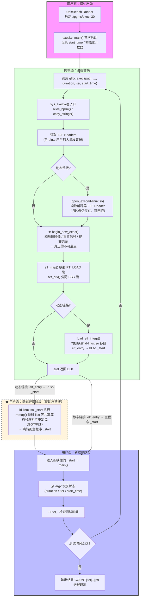
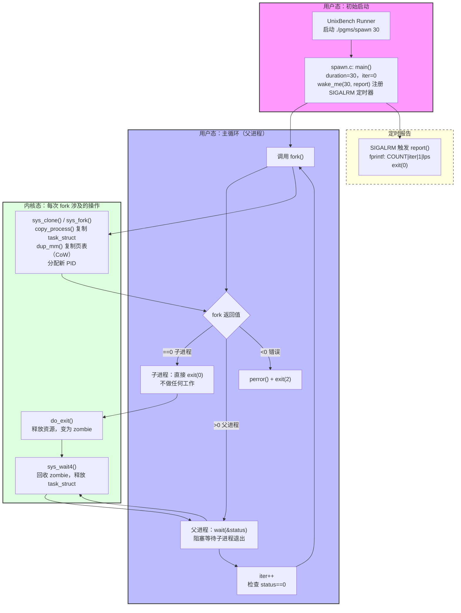
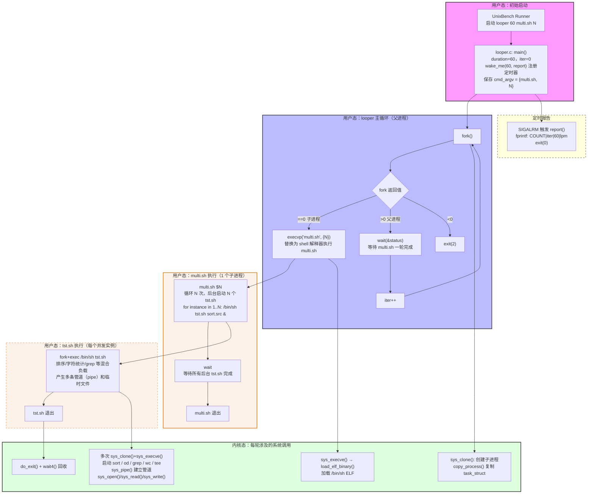

# UnixBench execl 测试正确流程图（对照内核源码修订版）

> 本文档依据 `linux-6.6.0-132.0.0.111.oe2403sp3.aarch64` 内核源码
> (`fs/exec.c`、`fs/binfmt_elf.c`) 逐步核对，修正了原始流程图中"清除旧映像时机"等错误。

---


## 一、完整流程图
/pgms/execl 30表示测试30s

```mermaid
flowchart TD
    subgraph US1 [用户态：初始启动]
        A["UnixBench Runner<br/>启动 ./pgms/execl 30"]
        B["execl.c: main() 首次运行<br/>记录 start_time，初始化 iter=0"]
        A --> B
    end

    subgraph US2 [用户态：glibc 封装]
        C["调用 glibc execl()<br/>转换为 execve(path, argv, envp)<br/>ARM64: x8=__NR_execve, svc #0"]
        B --> C
    end

    subgraph KS1 [内核态：系统调用入口]
        D["SYSCALL_DEFINE3(execve)<br/>→ do_execve()<br/>→ do_execveat_common()"]
        E["alloc_bprm()<br/>打开可执行文件 do_open_execat()<br/>分配并初始化 linux_binprm 结构"]
        F["检查 RLIMIT_NPROC<br/>拷贝 argv/envp 到 bprm 临时页"]
        C --> D --> E --> F
    end

    subgraph KS2 [内核态：安全与凭证检查]
        G["bprm_execve()<br/>→ prepare_bprm_creds()<br/>  准备新进程凭证 cred"]
        H["check_unsafe_exec()<br/>ptrace/suid 安全性检查"]
        F --> G --> H
    end

    subgraph KS3 [内核态：格式识别与 ELF 解析（旧映像仍存在）]
        I["search_binary_handler()<br/>读取文件头 128 字节 prepare_binprm()<br/>遍历 binfmt 链表，匹配 binfmt_elf"]
        J["load_elf_binary() 入口<br/>校验 ELF Magic / e_type / e_machine"]
        K["load_elf_phdrs()<br/>读取全部 Program Header Table"]
        L{"遍历 PHT<br/>找到 PT_INTERP?"}
        M["读取 PT_INTERP 路径字符串<br/>open_exec(elf_interpreter)<br/>打开 ld-linux.so 文件"]
        N["elf_read() 读取 ld-linux.so ELF Header<br/>load_elf_phdrs() 读取其 PHT<br/>（此时旧映像依然存在）"]
        O["arch_check_elf()<br/>架构级最终合法性检查"]
        H --> I --> J --> K --> L
        L -- 动态链接，存在 PT_INTERP --> M --> N --> O
        L -- 静态链接，无 PT_INTERP --> O
    end

    subgraph KS4 [内核态：不可逆点——清除旧映像]
        P["begin_new_exec()<br/>exec_mmap(): 释放旧 mm_struct，切换到新 mm<br/>do_close_on_exec(): 关闭 O_CLOEXEC fd<br/>flush_signal_handlers(): 重置信号处理<br/>commit_creds(): 提交新凭证<br/>★ 过了此点进程不可回头"]
        O --> P
    end

    subgraph KS5 [内核态：映射新程序段]
        Q["setup_arg_pages()<br/>为新程序建立用户态栈，推入 argc/argv/envp"]
        R["elf_map() 循环映射 PT_LOAD 段<br/>代码段(PROT_READ|EXEC)<br/>数据段(PROT_READ|WRITE)<br/>含 big.c 编译出的大量代码/数据"]
        S["set_brk()<br/>分配 BSS 段（含 bss[8*1024]）并清零"]
        P --> Q --> R --> S
    end

    subgraph KS6 [内核态：映射动态加载器并设置入口]
        T["load_elf_interp()<br/>elf_map() 将 ld-linux.so 各 PT_LOAD 段<br/>映射到用户地址空间"]
        U["elf_entry = interp_load_addr + interp_elf_ex->e_entry<br/>入口点改为 ld-linux.so 的 _start"]
        V["create_elf_tables()<br/>向栈写入 auxv（AT_ENTRY/AT_PHDR/AT_BASE 等）"]
        S -- 动态链接 --> T --> U --> V
        S -- 静态链接 --> V
    end

    subgraph KS7 [内核态 → 用户态：返回]
        W["start_thread(regs, elf_entry, bprm->p)<br/>修改 pt_regs->pc = elf_entry<br/>  动态链接: elf_entry = interp_load_addr + ld.so e_entry<br/>  静态链接: elf_entry = elf_ex->e_entry + load_bias<br/>修改 pt_regs->sp = 新栈顶<br/>ARM64 执行 eret 回 EL0"]
        V --> W
    end

    subgraph LD [用户态：动态链接阶段（ld-linux.so 执行，仅动态链接）]
        X["ld-linux.so _start 开始执行<br/>读取 auxv 获取主程序 PT_PHDR/AT_BASE"]
        Y["mmap() 映射 libc.so 等依赖库<br/>（通过 open()/mmap() 系统调用）"]
        Z["符号解析与重定位<br/>填写 GOT/PLT 表项"]
        W -- 动态链接: elf_entry → ld.so _start --> X --> Y --> Z
    end

    subgraph US3 [用户态：新程序执行]
        AA["跳转到主程序 _start<br/>→ __libc_start_main() → main()"]
        AB["从 argv 解析状态<br/>argv[2]=duration, argv[3]=iter, argv[4]=start_time"]
        AC["++iter, 检查 time() - start_time >= duration"]
        AD{时间到达?}
        AE["fprintf(stderr, 'COUNT|%lu|1|lps\\n', iter)<br/>exit(0)"]
        AF["execl(fullpath, fullpath, '0',<br/>dur_str, count_str, start_str, NULL)<br/>→ 回到 glibc execl()，重新进入内核"]
        Z --> AA
        W -- 静态链接: elf_entry → 主程序 _start --> AA
        AA --> AB --> AC --> AD
        AD -- 是 --> AE
        AD -- 否 --> AF --> C
    end

    %% 样式
    style US1  fill:#f9f0ff,stroke:#9b59b6,stroke-width:2px
    style US2  fill:#fef9e7,stroke:#f39c12,stroke-width:2px
    style KS1  fill:#eafaf1,stroke:#27ae60,stroke-width:2px
    style KS2  fill:#eafaf1,stroke:#27ae60,stroke-width:2px
    style KS3  fill:#eafaf1,stroke:#27ae60,stroke-width:2px
    style KS4  fill:#fdedec,stroke:#e74c3c,stroke-width:3px
    style KS5  fill:#eafaf1,stroke:#27ae60,stroke-width:2px
    style KS6  fill:#eafaf1,stroke:#27ae60,stroke-width:2px
    style KS7  fill:#eafaf1,stroke:#27ae60,stroke-width:2px
    style LD   fill:#fdf2e9,stroke:#e67e22,stroke-width:2px
    style US3  fill:#ebf5fb,stroke:#2980b9,stroke-width:2px
```



---

## 二、各步骤关键函数说明

### 2.1 用户态 → 系统调用入口

#### `execl()` → `execve()`（glibc）

glibc 的 `execl()` 是对 `execve()` 的封装，负责将可变参数列表转为 `argv[]` 数组，最终通过架构相关的系统调用指令陷入内核。在 ARM64 上：

```c
// 寄存器约定
x8 = __NR_execve  // 系统调用号
x0 = filename
x1 = argv
x2 = envp
svc #0            // 触发 EL0 → EL1 同步异常
```

---

### 2.2 内核态：系统调用入口层

#### `SYSCALL_DEFINE3(execve)` — `fs/exec.c:2143`

```c
SYSCALL_DEFINE3(execve,
    const char __user *, filename,
    const char __user *const __user *, argv,
    const char __user *const __user *, envp)
{
    return do_execve(getname(filename), argv, envp);
}
```

纯粹的系统调用入口，调用 `getname()` 将用户态文件名字符串拷贝到内核缓冲区后转交 `do_execve()`。

---

#### `do_execve()` — `fs/exec.c:2066`

```c
static int do_execve(struct filename *filename,
    const char __user *const __user *__argv,
    const char __user *const __user *__envp)
{
    struct user_arg_ptr argv = { .ptr.native = __argv };
    struct user_arg_ptr envp = { .ptr.native = __envp };
    return do_execveat_common(AT_FDCWD, filename, argv, envp, 0);
}
```

将用户态原生指针包装为 `user_arg_ptr`（兼容 32-on-64 compat 模式），指定基准目录为 `AT_FDCWD`（当前工作目录），然后调用通用实现。

---

#### `do_execveat_common()` — `fs/exec.c:1922`

核心协调函数，按顺序完成：

| 步骤 | 调用 | 说明 |
|---|---|---|
| 1 | `is_rlimit_overlimit(RLIMIT_NPROC)` | 检查用户进程数是否超限 |
| 2 | `alloc_bprm(fd, filename, flags)` | 打开文件 + 分配 `linux_binprm` |
| 3 | `count(argv, ...)` | 统计参数个数 |
| 4 | `bprm_stack_limits(bprm)` | 计算参数栈大小限制 |
| 5 | `copy_strings(...)` | 将 argv/envp 从用户态拷贝到 bprm 临时页 |
| 6 | `bprm_execve(bprm)` | 进入真正的执行逻辑 |

---

#### `alloc_bprm()` — `fs/exec.c:1517`

```c
static struct linux_binprm *alloc_bprm(int fd, struct filename *filename, int flags)
{
    file = do_open_execat(fd, filename, flags); // 打开可执行文件
    bprm = kzalloc(sizeof(*bprm), GFP_KERNEL); // 分配 linux_binprm
    bprm->file = file;
    bprm_mm_init(bprm); // 为新进程预先分配 mm_struct
    ...
}
```

`do_open_execat()` 在当前进程的 **Mount Namespace** 内查找文件，保证容器内读到的是容器镜像中的可执行文件，而非宿主机文件。

---

### 2.3 内核态：安全与凭证检查

#### `bprm_execve()` — `fs/exec.c:1869`

```c
static int bprm_execve(struct linux_binprm *bprm)
{
    prepare_bprm_creds(bprm);   // 复制当前 cred，准备新 cred
    check_unsafe_exec(bprm);    // 检查 ptrace/setuid 安全性
    current->in_execve = 1;
    sched_exec();               // 可能迁移到更空闲的 CPU
    security_bprm_creds_for_exec(bprm); // LSM 钩子（SELinux等）
    exec_binprm(bprm);          // 触发格式识别与加载
    ...
}
```

`sched_exec()` 是一个重要细节：exec 前内核可能将进程迁移到负载更低的 CPU 核心，以利用其冷缓存状态快速建立新进程映像。

---

### 2.4 内核态：格式识别（旧映像此时仍存在）

#### `search_binary_handler()` — `fs/exec.c:1768`

```c
static int search_binary_handler(struct linux_binprm *bprm)
{
    prepare_binprm(bprm);      // kernel_read() 读文件头 128 字节到 bprm->buf
    security_bprm_check(bprm); // LSM 二次检查
    read_lock(&binfmt_lock);
    list_for_each_entry(fmt, &formats, lh) {
        retval = fmt->load_binary(bprm); // 遍历调用各 binfmt 处理器
        if (retval != -ENOEXEC) break;
    }
}
```

`prepare_binprm()` 读取的 128 字节（`BINPRM_BUF_SIZE`）用于格式识别，ELF 文件头前 4 字节为 `\x7fELF`，匹配后调用 `binfmt_elf` 的 `load_elf_binary()`。

---

#### `load_elf_binary()` — `fs/binfmt_elf.c:829`

这是 ELF 加载的核心函数，分为两个大阶段（**以 `begin_new_exec()` 为分界**）：

**阶段一（旧映像仍存在，可以回滚）：**

```c
// 1. 从 bprm->buf 中读 ELF Header（已由 prepare_binprm 填充）
struct elfhdr *elf_ex = (struct elfhdr *)bprm->buf;

// 2. 校验 ELF Magic、类型、架构
if (memcmp(elf_ex->e_ident, ELFMAG, SELFMAG) != 0) goto out;

// 3. 读取 Program Header Table
elf_phdata = load_elf_phdrs(elf_ex, bprm->file);

// 4. 遍历 PHT，查找 PT_INTERP
for (i = 0; i < elf_ex->e_phnum; i++, elf_ppnt++) {
    if (elf_ppnt->p_type != PT_INTERP) continue;
    // 读取解释器路径，打开 ld-linux.so 文件
    interpreter = open_exec(elf_interpreter);
    // 读取 ld-linux.so 的 ELF Header
    elf_read(interpreter, interp_elf_ex, sizeof(*interp_elf_ex), 0);
    break;
}

// 5. 架构检查
arch_check_elf(elf_ex, !!interpreter, interp_elf_ex, &arch_state);
```

**阶段二（不可逆，旧映像清除后）：**

```c
// ★ 过了此行，进程回不去了
retval = begin_new_exec(bprm);   // ← 清除旧映像在这里！

setup_new_exec(bprm);
setup_arg_pages(bprm, ...);      // 建立新用户态栈

// 映射主程序所有 PT_LOAD 段
for (i = 0, elf_ppnt = elf_phdata; ...) {
    if (elf_ppnt->p_type != PT_LOAD) continue;
    elf_map(bprm->file, load_bias + vaddr, elf_ppnt, ...);
}

// 分配/清零 BSS 段（含 execl.c 里的 bss[8*1024]）
set_brk(elf_bss, elf_brk, bss_prot);

// 动态链接：映射 ld-linux.so 并以其入口作为 elf_entry
if (interpreter) {
    elf_entry = load_elf_interp(...);  // 映射 ld-linux.so 各段
    elf_entry += interp_elf_ex->e_entry; // 入口改为 ld.so _start
}

create_elf_tables(bprm, elf_ex, ...); // 写入 auxv 辅助向量

// 设置返回地址
start_thread(regs, elf_entry, bprm->p);
//   ARM64: regs->pc = elf_entry
//          regs->sp = bprm->p (新栈顶)
// eret 回 EL0
```

---

### 2.5 内核态：不可逆点——清除旧映像

#### `begin_new_exec()` — `fs/exec.c:1230`（关键！）

> ⚠️ 这是原始流程图的最大错误所在。旧映像的清除**不在** `sys_execve()` 入口，而在 `begin_new_exec()`，位于所有 ELF 合法性检查完毕之后。

```c
int begin_new_exec(struct linux_binprm *bprm)
{
    // 1. 替换旧内存映射（核心操作）
    retval = exec_mmap(bprm->mm);  // 旧 mm 释放，切换到新 mm

    // 2. 关闭 O_CLOEXEC 文件描述符
    do_close_on_exec(me->files);

    // 3. 重置信号处理函数为默认值
    flush_signal_handlers(me, 0);

    // 4. 提交新进程凭证
    commit_creds(bprm->cred);

    // 5. 更新 self_exec_id（通知 ptrace 等）
    WRITE_ONCE(me->self_exec_id, me->self_exec_id + 1);
    ...
}
```

设计原因：若在此之前的任何步骤失败（如 ELF 格式非法、权限不足），内核可以安全返回错误，旧进程继续运行。一旦 `begin_new_exec()` 中 `exec_mmap()` 执行，进程已无退路，失败只能以 `SIGSEGV` 终止。

---

### 2.6 内核态：建立新用户态栈

#### `setup_arg_pages()` — `fs/exec.c`

将之前临时存放在 bprm 内核页中的 argv/envp 拷贝到新程序的用户态栈，并建立 VMA：

```
高地址
┌─────────────┐ ← STACK_TOP
│   envp[]    │
│   argv[]    │  ← execl 传入的 "0", dur_str, count_str, start_str
│   argc      │
│   auxv      │  ← AT_ENTRY, AT_PHDR, AT_BASE 等，供 ld.so 使用
└─────────────┘ ← bprm->p (sp 初始值)
低地址
```

---

### 2.7 内核态：映射 ld-linux.so

#### `load_elf_interp()` — `fs/binfmt_elf.c:597`

```c
static unsigned long load_elf_interp(struct elfhdr *interp_elf_ex,
    struct file *interpreter, ...)
{
    for (i = 0; i < interp_elf_ex->e_phnum; i++, eppnt++) {
        if (eppnt->p_type == PT_LOAD) {
            map_addr = elf_map(interpreter, load_addr + vaddr, ...);
        }
    }
    return load_addr; // 返回 ld.so 的加载基地址
}
```

返回值加上 `interp_elf_ex->e_entry` 即为最终 `elf_entry`，也就是 `ld-linux.so` 的 `_start` 地址，内核将此值写入 `pt_regs->pc`。

---

### 2.8 用户态：动态链接阶段（ld-linux.so 完成）

`eret` 后 CPU 跳转到 `ld-linux.so` 的 `_start`，完成以下工作：

1. **读取 `auxv`**：从栈上获取 `AT_BASE`（自身加载地址）、`AT_ENTRY`（主程序入口）、`AT_PHDR` 等。
2. **解析依赖**：读取主程序 `PT_DYNAMIC` 段，找到 `DT_NEEDED` 条目（如 `libc.so.6`）。
3. **`mmap()` 共享库**：通过系统调用将 `libc.so` 等映射到地址空间。
4. **符号解析与重定位**：填写 GOT（Global Offset Table）和 PLT（Procedure Linkage Table）。
5. **跳转主程序**：最终跳转到 `AT_ENTRY` 即主程序 `_start`→`__libc_start_main()`→`main()`。

---

### 2.9 用户态：新程序 main() 执行

#### `execl.c main()` 递归逻辑

```c
int main(argc, argv)
{
    // 判断是首次启动还是递归实例
    duration = atoi(argv[1]);
    if (duration > 0) {
        // 首次启动：记录 start_time，构造 fullpath
        time(&start_time);
    } else {
        // 递归实例：从 argv 中恢复状态
        duration  = atoi(argv[2]);   // 总时长
        iter      = atoi(argv[3]);   // 当前计数
        sscanf(argv[4], "%lu", &start_time); // 开始时间
        fullpath  = argv[0];
    }

    sprintf(count_str, "%lu", ++iter);  // ★ iter 先自增再传出
    time(&this_time);
    if (this_time - start_time >= duration) {
        fprintf(stderr, "COUNT|%lu|1|lps\n", iter);
        exit(0);  // 时间到，报告结果
    }

    // 尚未超时：再次 execl 自身，传入最新状态
    execl(fullpath, fullpath, "0", dur_str, count_str, start_str, (void *)0);
    // 若 execl 返回，说明失败
    perror("Reason"); exit(1);
}
```

---

## 三、关键时序对比（原始流程图 vs 正确顺序）

| 阶段 | 原始流程图（错误） | 正确顺序（源码） |
|---|---|---|
| 旧映像清除时机 | `sys_execve()` 入口即清除 | `begin_new_exec()` 内 `exec_mmap()`，在 ELF 解析和 ld.so 头读取**之后** |
| PT_INTERP 检查与 ld.so 打开 | 位于旧映像清除之后 | 位于旧映像清除**之前**（可回滚阶段） |
| ld.so 映射时机 | 标注为"用户态" | **内核态** `load_elf_interp()` 完成，返回用户态时 ld.so 已在地址空间中 |
| iter 获取 | 写作"从 argv 获取 iter+1" | argv[3] 取到当前 iter，`++iter` 发生在调用 execl **之前** |
| **静态链接入口点（本次修正）** | 建立新程序栈后**所有路径**（含静态链接）都走 `ld-linux.so _start` | 静态链接：`elf_entry = elf_ex->e_entry + load_bias`（主程序入口），`eret` 后**直接**跳主程序 `_start`，**完全不经过 ld.so** |

---

## 四、`big.c` 的作用说明（内核视角）

`big.c` 通过 `#define main dummy` / `#include "big.c"` / `#undef main` 被整体编译进 `execl` 二进制，其内核加载影响体现在：

- **更大的 `PT_LOAD` 段**：`elf_map()` 需要映射更多页，产生更多 Page Fault。
- **更大的 BSS 段**（含 `bss[8*1024]`）：`set_brk()` 分配并清零更多物理页。
- **更多的符号重定位条目**：`ld-linux.so` 重定位工作量增加。

这些都让每次 `execl` 的内核路径更接近真实业务程序的加载开销，而非空程序的极值速度。

---

## 五、简化流程图（仿原始风格）

> **测试目标**：度量系统在单位时间内能完成多少次 `execl()` 调用（即进程映像完整替换），反映程序加载、动态链接和内核 ELF 处理的综合开销。  
> **运行方式**：`./pgms/execl 30`（测试 30 秒）

下面这张图保留 `UnixBench execl` 测试里最关键的装载路径，重点展示 `execl()` 之后内核、动态加载器和共享库参与的几个阶段，并修正了原始版本中的顺序错误。



- `execl()` 成功后不会返回到旧代码路径，当前进程直接变成新装入的程序映像。
- **关键修正（原始版）**：`PT_INTERP` 检查与 `ld-linux.so` Header 读取发生在旧映像清除（`begin_new_exec()`）**之前**，此阶段失败仍可安全回滚；`begin_new_exec()` 才是真正的不可逆点。
- `ld-linux.so` 的各 `PT_LOAD` 段由内核 `load_elf_interp()` 在**内核态**完成映射，控制权交给它时映射已存在；符号解析和重定位才是用户态行为。
- **本次补充修正**：静态链接时，`load_elf_binary()` 不调用 `load_elf_interp()`，`elf_entry = elf_ex->e_entry + load_bias`（主程序自身入口），`start_thread()` / `eret` 后 CPU **直接跳转到主程序 `_start`**，**完全不经过 ld-linux.so**。原流程图中静态链接路径汇入 `ld-linux.so _start` 是错误的。
- `big.c` 被编译进测试程序，增大二进制体积，让程序装载更接近真实负载。

---

## 六、spawn 测试流程图（Process Creation）

> **测试目标**：度量系统在单位时间内能完成多少次 `fork()` + 子进程退出的完整生命周期，反映进程创建开销。  
> **运行方式**：`./pgms/spawn 30`（测试 30 秒）



**关键说明：**
- spawn 只做 `fork()` + 子进程 `exit(0)`，**不执行任何 exec**，父进程同步 `wait()` 回收。
- 内核路径：`copy_process()` 复制 `task_struct`、页表（写时复制 CoW）、文件描述符表；子进程通过 `do_exit()` 变为 zombie，父进程 `wait4()` 将其彻底回收。
- 与 `execl` 的核心区别：无 ELF 加载、无 `mmap`，纯粹测试进程数据结构的分配/复制/回收开销。
- `wake_me()` 通过 `setitimer(ITIMER_REAL)` 注册 30 秒后的 `SIGALRM`，信号触发时调用 `report()` 输出结果。

---

## 七、shell1 / shell8 测试流程图（Shell Scripts）

> **测试目标**：度量系统每分钟能完成多少次 Shell 脚本执行，反映 `fork+exec+shell+子命令` 的综合开销。  
> **运行方式**：
> - `shell1`：`./pgms/looper 60 ./pgms/multi.sh 1`（1 路并发，测 60 秒）  
> - `shell8`：`./pgms/looper 60 ./pgms/multi.sh 8`（8 路并发，测 60 秒）



**关键说明：**

| 层级 | 程序 | 系统调用 |
|---|---|---|
| 调度层 | `looper`（C程序） | `fork()` + `wait()` 循环，计数 |
| Shell层 | `multi.sh`（sh脚本） | `fork+execve(/bin/sh)` 加载 Shell 解释器 |
| 并发层 | N×`tst.sh`（sh脚本） | 每个 `tst.sh` 再 `fork+exec` 启动 `sort`/`od`/`grep`/`wc`/`tee` |
| 工作层 | `sort`/`od`/`grep`… | 文件读写、管道通信、排序计算 |

- **shell1 vs shell8 的区别**：`multi.sh` 接收的参数 `N` 决定后台并发的 `tst.sh` 数量。shell8 每轮同时启动 8 个 `tst.sh`，内核需同时处理 8 组 `fork+exec+pipe`，对调度器、VFS、页分配器的压力是 shell1 的数倍。
- **计时单位**：looper 的 `report()` 输出 `COUNT|iter|60|lpm`（loops per minute），与 `execl`/`spawn` 的 `lps` 不同。
- **内核热点**：`tst.sh` 内大量使用管道（`|`），每条管道都要 `sys_pipe()`、两次 `fork()`、`dup2()` 重定向，这是 shell 类测试比 `spawn` 内核开销更重的根本原因。

---

## 八、各测试项实测瓶颈分析

### 8.1 汇总表格

| 测试项       | 场景/编译方式 | 主要瓶颈点                   | 热点函数        | 热点锁                   | 备注                                              |
| :----------- | :------------ | :--------------------------- | :-------------- | :----------------------- | :------------------------------------------------ |
| **execl**    | 动态编        | 加载共享库、符号解析和重定位 | `down_write`    | `&mapping->i_mmap_rwsem` | 涉及频繁内存操作                                  |
| **execl**    | 静态编译      | 页错误处理 (Page Fault)      | `do_page_fault` | `folio_wait_table`       | 消除动态链接瓶颈后，分数提升 **~8倍**             |
| **spawn**    | 动态编译      | 进程等待与资源回收           | `do_wait`       | `tasklist_lock`          | 大量 `fork` 后父进程等待子进程导致的全局锁竞争    |
| **shell1/8** | 动态编译      | 文件映射与地址空间操作       | `down_write`    | `&mapping->i_mmap_rwsem` | 热点函数、热点锁与 `execl` 动态链接场景高度一致。 |

| 测试项 | 编译方式 | 主要瓶颈 | 热点函数 | 热点锁 | 备注 |
|---|---|---|---|---|---|
| **execl** | 动态链接（默认） | 动态链接阶段：`ld.so` 加载 `libc` 等共享库时，多进程并发访问同一 inode 的内存映射 | `down_write` | `&mapping->i_mmap_rwsem` | 40容器并发时锁竞争剧烈，分数断崖式下跌 |
| **execl** | 静态编译（`-static`） | 静态编译消除动态链接后，瓶颈转移至 ELF 段的缺页中断处理（有待确认） | `do_page_fault` | `folio_wait_table`（页等待队列哈希锁） | 静态编译较动态编译**分数提升约 8 倍** |
| **spawn** | 动态链接 | 进程等待与回收：父进程 `wait()` 阻塞在全局进程树锁上 | `do_wait` | `tasklist_lock` | 无 exec 路径，纯 fork+wait 开销 |
| **shell1** | 动态链接 | 动态链接阶段：`/bin/sh` 及 `sort`/`grep` 等工具加载 `libc` 时并发竞争 inode 映射锁 | `down_write` | `&mapping->i_mmap_rwsem` | 与 execl 动态链接瓶颈同源 |
| **shell8** | 动态链接 | 同 shell1，但 8 路并发使锁竞争强度 ×8 | `down_write` | `&mapping->i_mmap_rwsem` | 每轮启动 8×`tst.sh`，锁热点更突出 |


`down_write`
```C
// kernel/locking/rwsem.c
/*
 * lock for writing
 */
void __sched down_write(struct rw_semaphore *sem)
{
	might_sleep();
	rwsem_acquire(&sem->dep_map, 0, 0, _RET_IP_);
	LOCK_CONTENDED(sem, __down_write_trylock, __down_write);
}
EXPORT_SYMBOL(down_write);

// include/linux/lockdep.h
#define LOCK_CONTENDED(_lock, try, lock) \
	lock(_lock)

// 所以
// LOCK_CONTENDED(sem, __down_write_trylock, __down_write);等价于
// __down_write(sem);


// kernel/locking/rwsem.c

/*
 * lock for writing
 */
static __always_inline int __down_write_common(struct rw_semaphore *sem, int state)
{
	int ret = 0;

	preempt_disable();
	if (unlikely(!rwsem_write_trylock(sem))) {
		if (IS_ERR(rwsem_down_write_slowpath(sem, state)))
			ret = -EINTR;
	}
	preempt_enable();
	return ret;
}

static __always_inline void __down_write(struct rw_semaphore *sem)
{
	__down_write_common(sem, TASK_UNINTERRUPTIBLE);
}

```
所以`down_write -> __down_write_common -> rwsem_down_write_slowpath`，与火焰图抓取到的调用栈对应。
---

### 8.2 热点锁说明

#### `i_mmap_rwsem`（`struct address_space->i_mmap_rwsem`，`mm/mmap.c`）

**广义调用场景（任意内核路径）：**

| 操作 | 锁类型 | 触发路径 |
|---|---|---|
| `mmap()` 建立文件映射 | 写锁 | `do_mmap()` → `mmap_region()` → `vma_link()` → `i_mmap_lock_write(mapping)` |
| `munmap()` / `unmap_vmas()` 解除文件映射 | 写锁 | `do_munmap()` → `unmap_vmas()` → `i_mmap_lock_write(mapping)` |
| `msync()` / `msync_interval()` | 写锁 | 遍历 `i_mmap` 树时需获取写锁 |
| `truncate()` / `fallocate()` 截断文件 | 写锁 | `truncate_inode_pages_range()` → 遍历 `mapping->i_mmap` 时加写锁 |
| 缺页中断处理（文件映射） | 读锁 | `handle_mm_fault()` → `filemap_fault()` → 读取 `i_mmap` 树时加读锁 |
| `try_to_unmap()` 页面回收 | 读锁 | `rmap_walk_file()` → `i_mmap_lock_read(mapping)` 遍历所有持有该页的 VMA |
| `mm_take_all_locks()` | 写锁 | `vm_lock_mapping()` → `down_write_nest_lock(&mapping->i_mmap_rwsem)` （内存管理锁序操作） |

**在 execl/shell 测试中的竞争路径：**

动态链接时，`ld.so` 在用户态通过 `mmap()` 系统调用映射 `libc.so` 等共享库，内核路径为：
```
mmap(libc.so, ...) → sys_mmap → do_mmap() → mmap_region()
    → vma_link() → i_mmap_lock_write(mapping)   ← 写锁，多进程串行
```
原文档中的 `load_elf_interp() → elf_map() → vma_link()` 路径**描述的是内核在 ELF 加载阶段的 mmap**，其底层同样经过 `vma_link()`，因此写锁路径方向正确，但该路径对应的是**内核态加载可执行文件本身的各 PT_LOAD 段**（包括 `ld.so` 的映射），而非 `ld.so` 在用户态映射 `libc.so` 的过程。两阶段都会触发 `i_mmap_rwsem`，竞争来源相同，只是发生时机不同。

---

#### `tasklist_lock`（`kernel/exit.c`，rwlock_t）

**广义调用场景（任意内核路径）：**

| 操作 | 锁类型 | 触发路径 |
|---|---|---|
| `fork()` / `clone()` 创建进程 | 写锁 | `copy_process()` → `write_lock_irq(&tasklist_lock)` 将新进程挂入进程树 |
| 进程退出 `exit()` 脱离进程树 | 写锁 | `do_exit()` → `exit_notify()` → `write_lock_irq(&tasklist_lock)` |
| `wait()` / `waitpid()` 回收子进程 | 读锁 | `do_wait()` → `read_lock(&tasklist_lock)` 遍历子进程链表 |
| `kill()` / 发送信号 | 读锁 | `kill_something_info()` → `read_lock(&tasklist_lock)` 查找目标进程 |
| `ptrace()` attach/detach | 写锁 | `ptrace_attach()` → `write_lock_irq(&tasklist_lock)` 修改进程关系 |
| `/proc` 文件系统读取进程信息 | 读锁 | `proc_pid_readdir()` → `read_lock(&tasklist_lock)` 遍历进程列表 |
| `prctl(PR_SET_CHILD_SUBREAPER)` | 写锁 | 修改进程 subreaper 关系时需写锁 |

**在 spawn 测试中的竞争路径：**
```
父进程: wait() → sys_wait4() → do_wait()
            → read_lock(&tasklist_lock)  ← 读锁，等待子进程状态变化
子进程: exit(0) → do_exit() → exit_notify()
            → write_lock_irq(&tasklist_lock) ← 写锁，修改进程树
```
spawn 测试每轮需要完成一次写锁（exit）+ 一次读锁（wait），在高并发下数千进程同时争夺这一全局 rwlock，读写锁互斥导致严重串行化。

---

#### `folio_wait_table`（`mm/filemap.c`，哈希表 + spinlock）

**广义调用场景（任意内核路径）：**

| 操作 | 触发路径 |
|---|---|
| 文件映射缺页中断（Page-In）等待 | `do_page_fault()` → `filemap_fault()` → `folio_lock_killable()` → `__folio_wait_locked()` → `wait_on_folio_bit()` |
| `read()` / `readahead()` 等待页面从磁盘加载 | `filemap_read()` → `filemap_get_pages()` → `folio_wait_locked()` |
| `write()` 等待页面锁（如需 CoW） | `balance_dirty_pages()` → `folio_wait_writeback()` |
| `mmap` 的 populate（`MAP_POPULATE`） | `do_fault()` → `filemap_fault()` → 等待锁定页面 |
| 内存回收时等待脏页回写完成 | `shrink_page_list()` → `folio_wait_writeback()` |
| `fsync()` 等待页面写回 | `filemap_write_and_wait_range()` → `folio_wait_writeback()` |

哈希表结构：`folio_wait_table` 是一个大小为 `PAGE_WAIT_TABLE_SIZE`（默认 256 项）的等待队列数组，每个哈希桶是一个 `wait_queue_head_t`（含 spinlock）。多个进程等待不同 folio 时若哈希到同一桶，即使物理页不同也会发生"伪竞争"（类似 False Sharing）。

**在静态编译 execl 中的触发原因：**
```
// 静态二进制大（含 libc 代码），exec 时 mmap 段但不立即读入物理页
// 首次访问代码段触发缺页：
do_page_fault() → handle_mm_fault() → __do_fault()
    → filemap_fault()               ← 文件映射缺页
        → folio_lock(folio)
            → __folio_wait_locked() ← 如页正在被其他进程 Page-In 中
                → add_to_wait_queue(folio_wait_table[hash(folio)])
                    → spin_lock(bucket->lock)  ← 哈希桶锁竞争
```
多容器并发加载同一静态二进制时，大量进程同时等待同一批代码页，哈希桶锁成为热点。

---

### 8.3 静态编译前后瓶颈迁移示意

```
动态编译 execl                           静态编译 execl
─────────────────────────               ─────────────────────────
load_elf_binary()                        load_elf_binary()
    │                                        │
    ├─ 检查 PT_INTERP ──发现 ld.so           ├─ 无 PT_INTERP
    │                                        │
    ├─ load_elf_interp()                     ├─ 直接 begin_new_exec()
    │   └─ elf_map(libc.so...)               │
    │       └─ ★ down_write                  ├─ elf_map(大体积静态段)
    │          (&i_mmap_rwsem)  ← 瓶颈       │   └─ mmap 成功，但缺页 ←─┐
    │                                        │                           │
    └─ start_thread() → _start              ├─ 运行时触发 do_page_fault  │
                                             │   └─ filemap_fault()      │
分数低：锁序列化                             │       └─ ★ folio_wait_table│ ← 新瓶颈
                                             └─ 分数高（约 ×8）：无 ld.so 开销
```
